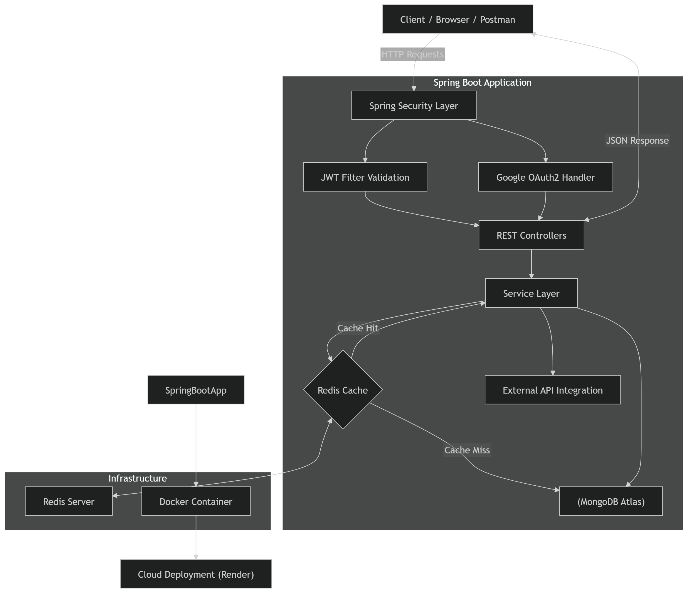

📘 Journal Backend Application

A production-ready backend service for a journaling platform built using Java 21 + Spring Boot 3.
The system provides secure authentication, role-based access, caching, and cloud-ready deployment using Docker.

This project demonstrates real-world backend engineering practices including stateless authentication, layered architecture, environment-based configuration, and performance optimization using Redis.

🚀 Features

🔐 JWT-based Stateless Authentication
🔑 Google OAuth2 Login Integration
👤 Role-Based Access Control (User/Admin)
📝 Journal Entry CRUD APIs
⚡ Redis Caching for Performance Optimization
🍃 MongoDB Atlas Integration
📦 Docker Multi-Stage Containerization
🌐 Cloud Deployment Ready (Render Compatible)
📚 OpenAPI / Swagger API Documentation
🔒 Secure Config via Environment Variables
🧩 Layered Architecture (Controller → Service → Repository)
📊 Sentiment Enum Tagging for Entries
🌦 External API Integration (Weather Example Included)
🛠 Production Debugging & Profile-Based Config (dev/prod)

🏗 Tech Stack

| Layer            | Technology                   |
| ---------------- | ---------------------------- |
| Backend          | Spring Boot 3, Java 21       |
| Security         | Spring Security, JWT, OAuth2 |
| Database         | MongoDB Atlas                |
| Caching          | Redis                        |
| Build Tool       | Maven                        |
| Containerization | Docker (Multi-stage)         |
| Deployment       | Render (Cloud Ready)         |
| Docs             | Swagger / OpenAPI            |
| Version Control  | Git + GitHub                 |

📂 Project Structure

com.DT.journal
│
├── controller        → REST API Endpoints
├── service           → Business Logic
├── repository        → MongoDB Data Access
├── entity            → Domain Models
├── dto               → Request/Response Mapping
├── config            → Security, Redis, Swagger Config
├── filter            → JWT Authentication Filter
├── cache             → Redis Cache Layer
├── enums             → Domain Constants
└── api               → External API Integrations

🔐 Authentication Flow

User logs in using:
Email + Password (JWT)
Google OAuth2
Server generates stateless JWT token
Token validated via JwtFilter on each request
No session storage → fully scalable architecture

⚡ Caching Strategy

Redis is used to:
Reduce repeated DB reads
Cache frequently accessed journal/user metadata
Improve response latency for read-heavy operations

🌍 Environment-Based Configuration

Sensitive values are externalized:
SPRING_DATA_MONGODB_URI=
JWT_SECRET=
GOOGLE_CLIENT_ID=
GOOGLE_CLIENT_SECRET=
REDIS_HOST=
REDIS_PORT=
MAIL_USERNAME=
MAIL_PASSWORD=

Supports:

dev profile → local development
prod profile → cloud deployment

🐳 Docker Deployment

Build Image:
docker build -t journal-app .

Run Container:
docker run -p 8080:8080 journal-app

Uses multi-stage build for small production image.

📖 API Documentation

Swagger UI available at:
/swagger-ui/index.html

🧠 Key Engineering Concepts Demonstrated

Stateless Security Architecture
Clean Separation of Concerns
Production Configuration Management
Containerized Deployment Workflow
Performance Optimization with Cache Layer
External Service Integration
Debugging Real Deployment Failures

🔗 Live Deployment

https://journal-backend-4a4m.onrender.com

👨‍💻 Author

Deeptanshu Tiwari

🏗 System Architecture

## 🖼 Architecture Diagram

